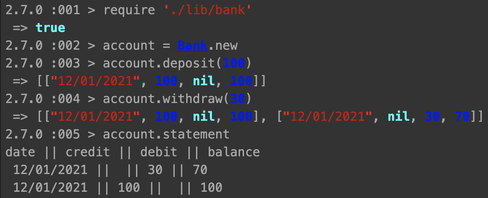

# Bank Tech Test

### How to Run the App
```
$ git clone https://github.com/francescoFH/bank-tech-test
$ bundle install
$ irb
  > require './lib/bank.rb'
  > account = Bank.new
  > account.deposit(100)
  > account.withdraw(30)
  > account.statement
    date || credit || debit || balance
     12/01/2021 ||  || 30 || 70
     12/01/2021 || 100 ||  || 100
```


### To Test the App
```
$ rspec
$ rubocop
```
Approach
---
I have created three different classes to keep my app simple and readable:
  * Bank class to be able to create accounts, make deposits and withdraws and to see statements;
  * Register class to be able to store the transactions;
  * Statement class to be able to print the statement correctly.

I have used SimpleCov and achieved a total coverage of 98.77% and rubocop to write my code with the right syntax.

### User Stories
```
As a customer,
So that I can keep control of my money,
I want to open a bank account.
```
```
As a customer,
So that I can safely keep my money in a bank,
I want to make deposits into my account.
```
```
As a customer,
So that I can take out my money from my bank,
I want to make withdrawals from my account.
```
```
As a customer,
So that I can see my transactions
I want to print a bank statement
```

### Acceptance criteria

**Given** a client makes a deposit of 1000 on 10-01-2021  
**And** a deposit of 2000 on 11-01-2021
**And** a withdrawal of 500 on 12-01-2021  
**When** she prints her bank statement  
**Then** she would see

```
date || credit || debit || balance
12/01/2021 || || 500.00 || 2500.00
11/01/2021 || 2000.00 || || 3000.00
10/01/2021 || 1000.00 || || 1000.00
```
